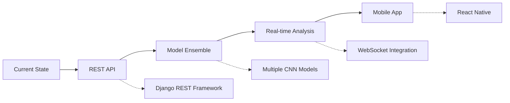

# 🔬 Skin Cancer Prediction Web App

> **AI-Powered Dermatological Analysis** • Built with Django & Custom CNN Architecture

A sophisticated web application leveraging deep learning to classify skin lesions across 9 distinct cancer types using a custom-trained Convolutional Neural Network.

---

## 🏗️ **Project Architecture**

```
skin-cancer-prediction/
┌─ 🗄️  db.sqlite3                    # SQLite database
├─ 🚀  manage.py                     # Django entry point  
├─ 📦  requirements.txt              # Python dependencies
├─ 🐳  Dockerfile                    # Container configuration
├─ 🧠  skin_cancer_custom_cnn.h5     # Pre-trained CNN model (Git LFS)
│
├─ 🔮  predictor/                    # ML Prediction Module
│  ├─ 📊  views.py                   # Business logic & predictions
│  ├─ 🛣️   urls.py                   # Route definitions
│  └─ 🎨  templates/                 # Frontend templates
│
└─ ⚙️   skincancer/                  # Django Core Configuration
   ├─ 🔧  settings.py               # App settings & configurations
   ├─ 🌐  urls.py                   # URL routing patterns
   └─ 📡  wsgi.py                   # WSGI application gateway
```

---

## 🎯 **Supported Classifications**

<table>
<tr>
<td>

**Malignant Conditions**
- 🔴 **Melanoma**
- 🟠 **Basal Cell Carcinoma** 
- 🟡 **Squamous Cell Carcinoma**
- 🟤 **Actinic Keratosis**

</td>
<td>

**Benign Conditions**
- 🔵 **Nevus**
- 🟢 **Dermatofibroma**
- 🟣 **Pigmented Benign Keratosis**
- ⚫ **Seborrheic Keratosis**
- 🔘 **Vascular Lesion**

</td>
</tr>
</table>

---

## ⚡ **Key Features**

```yaml
🖼️  Image Upload:        Drag & drop interface
🤖  AI Classification:   9-class CNN prediction
📊  Confidence Scores:   Real-time probability analysis
🎨  Modern UI/UX:        Responsive design
🐳  Docker Ready:        One-click deployment
📱  Mobile Friendly:     Cross-platform support
```

---

## 🚀 **Quick Start Guide**

### **Local Development**

```bash
# 1️⃣ Clone & Navigate
git clone https://github.com/yourusername/skin-cancer-prediction.git
cd skin-cancer-prediction

# 2️⃣ Install Dependencies
pip install -r requirements.txt

# 3️⃣ Database Setup
python manage.py migrate

# 4️⃣ Launch Server
python manage.py runserver
```

**🌐 Access:** `http://127.0.0.1:8000`

### **Docker Deployment**

```bash
# Build Image
docker build -t skin-cancer-app .

# Run Container
docker run -p 8000:8000 skin-cancer-app
```

---

## 📈 **Model Specifications**

| **Attribute** | **Details** |
|---------------|-------------|
| **Architecture** | Custom CNN with Transfer Learning |
| **Input Size** | 224×224×3 RGB Images |
| **Classes** | 9 Skin Cancer Types |
| **Framework** | TensorFlow/Keras |
| **File Size** | ~100MB (Git LFS Tracked) |

---

## 💾 **Large File Management**

For models exceeding GitHub's 100MB limit:

```bash
# Initialize Git LFS
git lfs install
git lfs track "*.h5"

# Commit Model
git add .gitattributes skin_cancer_custom_cnn.h5
git commit -m "🧠 Add CNN model via Git LFS"
git push
```

---

## 🔮 **Roadmap & Future Enhancements**



**Planned Features:**
- 🔌 **REST API** with Django REST Framework
- 📊 **Enhanced Analytics** with confidence visualization
- 🤝 **Model Ensemble** for improved accuracy
- 🎨 **UI Redesign** with Tailwind CSS
- 📱 **Mobile Application** for on-the-go diagnosis
- ☁️ **Cloud Deployment** on AWS/GCP
- 🔐 **User Authentication** & history tracking

---

## 🤝 **Contributing**

We welcome contributions! Please see our [Contributing Guidelines](CONTRIBUTING.md) for details.

---

## ⚠️ **Medical Disclaimer**

> **Important:** This application is for educational and research purposes only. It should not be used as a substitute for professional medical diagnosis or treatment. Always consult qualified healthcare professionals for medical concerns.

---


<div align="center">

**Built with ❤️ using Django, TensorFlow & Modern Web Technologies**

[](https://python.org)
[](https://djangoproject.com)
[](https://tensorflow.org)
[](https://docker.com)

</div>
